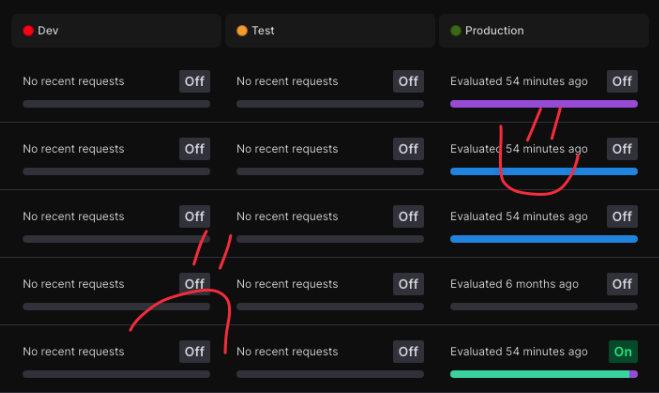
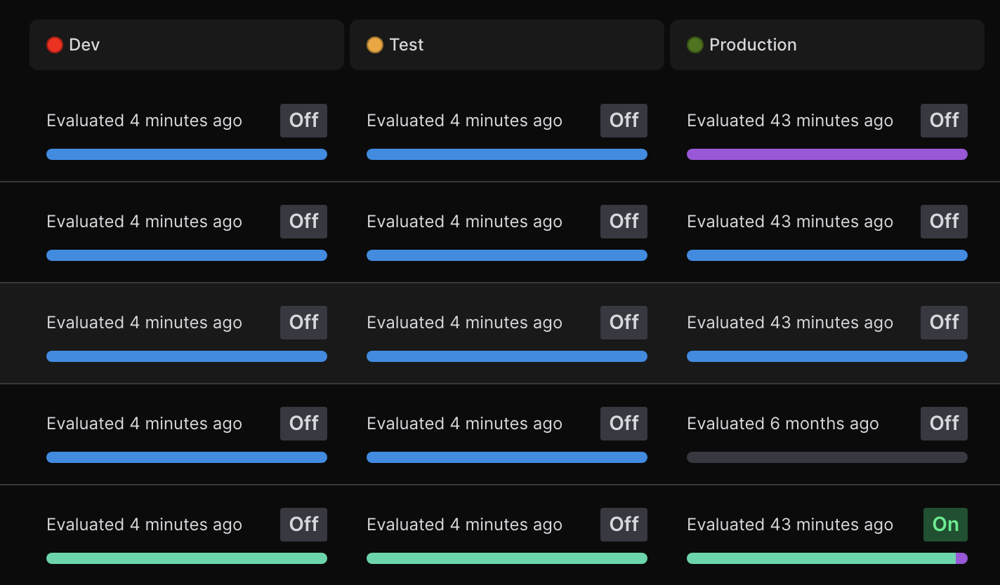

# What is this?
It's a way to evaluate flags across multiple LaunchDarkly environments. Used to populate demo instances. It will evaluate all flags in the environments of your choice every 30 seconds.

Note: you may want to set targeting to various rollouts across your different environments, so that you don't end up with everything looking samey across every environment, like in my 'after' picture.

Go from this:

To this:

# How can I use it?
1. `pip install requirements.txt`
2. Rename `.env.example` to `.env`
3. Replace the environment variables in `.env` with your values.
4. `python main.py`
5. Press `ctrl/cmd + c` to stop the process